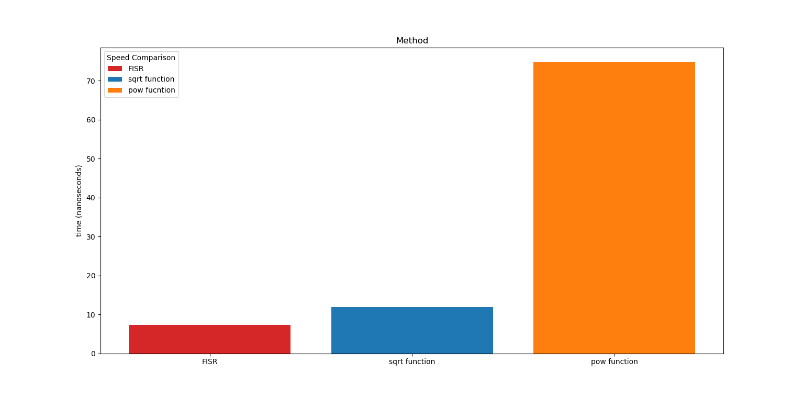

# Fast Inverse Square Root Implementation

This C code implements the "fast inverse square root" method for calculating the inverse square root of a floating-point number and was popularized for its use in the game Quake III Arena. The algorithm uses a combination of bit-level operations and Newton's method to achieve a fast and efficient computation. 

## Overview

The code consists of a single function, Q_rsqrt, which takes a float input number and returns its inverse square root. The main function demonstrates how to use Q_rsqrt by parsing a command-line argument as a float and printing the result.

## Line 12: Tricking C

i = * ( long * ) &y; : This line performs a bitwise cast of the float variable y to a long integer. This is done by taking the address of y (&y), casting it to a long* pointer, and then dereferencing it (*). This tricks C into thinking that a long integer is stored there and allows us to access the bit-level representation of the float value.

## Line 13: The "Magic Number" Operation

The line i = 0x5f3759df - (i >> 1); is the core of the "fast inverse square root" method. This line performs a bitwise operation that is often referred to as a "magic number" hack.

Here's a breakdown of what's happening:

i is a long integer that stores the bit-level representation of the input float y.
0x5f3759df is a hexadecimal constant that is used as a "magic number" in this operation.
i >> 1 performs a bitwise right shift of i by 1 bit. This effectively divides the integer value of i by 2.
The result of the right shift is subtracted from the magic number 0x5f3759df.
The resulting value is stored back in i. This operation has the effect of approximating the inverse square root of the input float value.

Why does this work?

The "magic number" operation exploits the structure of the IEEE 754 floating-point representation. Specifically, it takes advantage of the fact that the exponent and mantissa of a floating-point number are stored in separate parts of the binary representation.

By performing a bitwise operation on the integer representation of the float, we can manipulate the exponent and mantissa simultaneously. The magic number 0x5f3759df is carefully chosen to produce an initial approximation of the inverse square root.

The subsequent Newton's method iteration (line 15) refines this approximation to produce a more accurate result.

## Comparison with math.h functions

Below is a runtime comparison between the Fast Inverse Square Root Algorithm and implementation of two math.h functions - pow(N, -0.5) and 1/sqrt(N)

